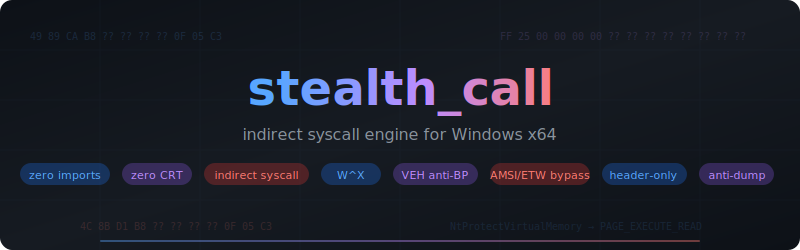
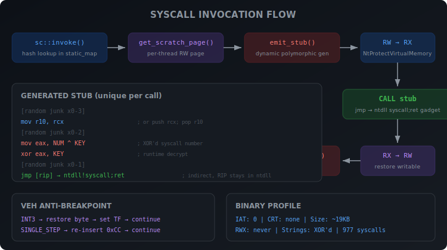

<p align="center">
  
</p>

<p align="center">
  <a href="#features"></a>
  <a href="#features"></a>
  <a href="#features"></a>
  <a href="#features"></a>
  <a href="LICENSE"></a>
</p>

---

## What is this?

Header-only library for Windows x64 that lets you invoke any NT syscall without touching ntdll imports, without leaving strings in your binary, and without the usual red flags that make EDRs lose their minds.

No CRT. No STL. No IAT. The whole thing compiles down to ~19KB with literally zero DLL dependencies.

Built to avoid the common pitfalls of existing syscall libraries — plaintext strings, known hash constants, direct syscall from non-ntdll memory, IAT imports that scream "I'm doing something weird", SEC_NO_CHANGE IOC, CRT bloat. None of that here.

---

## Features

**Syscall Engine**
- Indirect syscalls — stubs jump into ntdll's own `syscall; ret` gadget, so RIP is always inside ntdll when the syscall instruction fires
- Per-call stub generation — every single invocation builds a fresh stub with random junk, random layout, XOR'd syscall number. Nothing is reused
- W^X enforcement — scratch pages go RW → RX → RW. RWX is never allocated, period
- Stubs wiped immediately after each call
- Syscalls extracted from `\KnownDlls\ntdll.dll` section mapping (no filesystem access, invisible to ProcMon)
- 977 syscalls resolved on a typical Win11 system

**Anti-Breakpoint**
- VEH-based approach — if a debugger drops a 0xCC on your target function, the exception handler silently restores the original byte, executes the instruction under single-step, then puts the breakpoint back. Debugger never knows it was bypassed. Zero timing window
- Works on any function in any DLL, not just ntdll

**Evasion**
- AMSI bypass — patches `AmsiScanBuffer` to return S_OK
- ETW bypass — patches `EtwEventWrite` to return SUCCESS
- All patching done through direct syscalls, not VirtualProtect
- XOR-encrypted strings everywhere — DLL names, paths, everything. Decrypted on stack, wiped after use
- Custom hash algorithm (not FNV-1a, not CRC32 — no known YARA signatures)
- PEB walk for all module/function resolution — no GetModuleHandle, no GetProcAddress

**Code Quality**
- Header-only, drop the `stealth/` folder into your project and go
- Thread-safe via per-thread scratch pages + spinlocks
- Full cleanup on shutdown — scratch pages freed, maps zeroed, VEH removed
- Hook detection for common EDR trampolines (jmp rel32, jmp [rip], mov rax + jmp rax)

---

## How It Works

<p align="center">
  
</p>

### Syscall Path

1. `initialize()` opens ntdll through `\KnownDlls` section, parses PE exports, grabs every syscall number
2. Scans ntdll `.text` for a `syscall; ret` gadget — this is where the actual syscall instruction will execute from
3. When you call `sc::invoke()`:
   - Looks up the syscall entry by hash
   - Grabs the calling thread's scratch page (or allocates one, RW only)
   - `emit_stub()` builds a unique polymorphic stub — random junk instructions before/after, XOR-obfuscated syscall number with a per-call key, indirect jmp to the ntdll gadget
   - Flips the page RW → RX
   - Calls through the stub
   - Flips back RX → RW
   - Zeroes out the stub bytes

At no point does RWX memory exist. At no point does a `syscall` instruction execute outside of ntdll. At no point are syscall numbers stored in plaintext.

### VEH Trampoline

You call `tramp::invoke()` with the target function. If there's no breakpoint — the function just runs normally with zero overhead. If a debugger placed 0xCC:

1. INT3 exception fires
2. Our VEH handler checks if the address is in our table (hash lookup, not linear scan)
3. Restores the original byte from a clean copy read off disk
4. Sets the Trap Flag
5. Continues execution — the real instruction runs
6. Single-step exception fires
7. Handler puts 0xCC back

The debugger's breakpoint list still shows it as active. The breakpoint just never triggers on our calls.

---

## Build

```bash
cmake -B build -A x64
cmake --build build --config Release
```

Needs MSVC (VS 2019+) and CMake 3.15+. Output is ~19KB with zero imports.

---

## Usage

### Syscalls

```cpp
#include "stealth/syscall.hpp"

stealth::sc::initialize();

PVOID base = nullptr;
SIZE_T size = 0x1000;
NTSTATUS status = stealth::sc::invoke<NTSTATUS>(
    HASH("NtAllocateVirtualMemory"),
    NtCurrentProcess(), &base, (ULONG_PTR)0, &size,
    (ULONG)(MEM_COMMIT | MEM_RESERVE), (ULONG)PAGE_READWRITE
);
```

### Anti-Breakpoint

```cpp
#include "stealth/trampoline.hpp"

// works even if x64dbg has a BP on MessageBoxA
int ret = stealth::tramp::invoke<int>(
    HASH_CI("user32.dll"), HASH("MessageBoxA"),
    (HWND)nullptr, (LPCSTR)"hello", (LPCSTR)"title", (UINT)MB_OK
);
```

### AMSI / ETW

```cpp
#include "stealth/bypass.hpp"

stealth::bypass::patch_etw();
stealth::bypass::patch_amsi();
```

### Cleanup

```cpp
stealth::tramp::shutdown();
stealth::sc::shutdown();
```

---

## Project Structure

```
stealth/
  common.hpp      — memory ops, spinlock, static_map, PRNG, debug output
  hash.hpp        — compile-time custom hash
  xorstr.hpp      — compile-time XOR string encryption
  peb.hpp         — PEB walk, PE export parser, hook detection
  syscall.hpp     — indirect syscall engine, stub generator, W^X, anti-dump
  trampoline.hpp  — VEH-based anti-breakpoint
  bypass.hpp      — AMSI + ETW patching
```

---

## License

MIT — do whatever you want with it.
